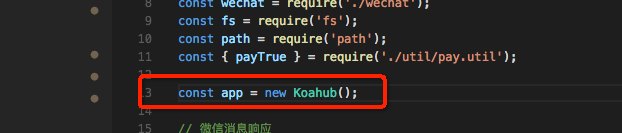
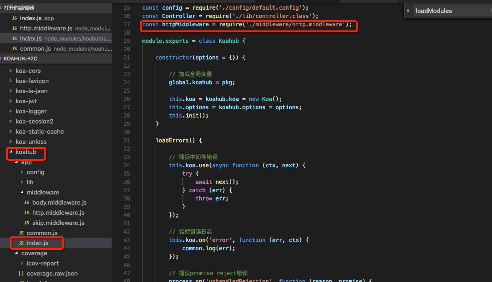
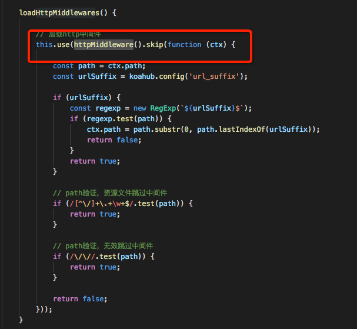
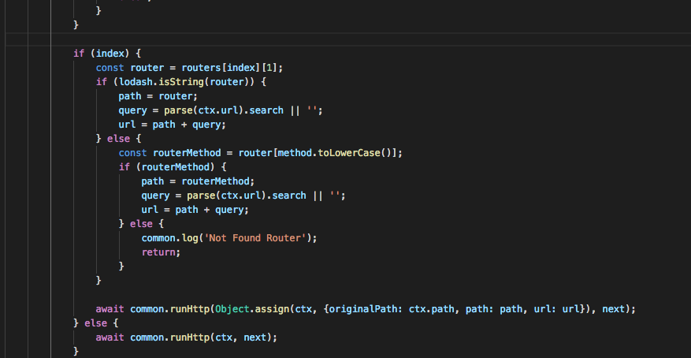
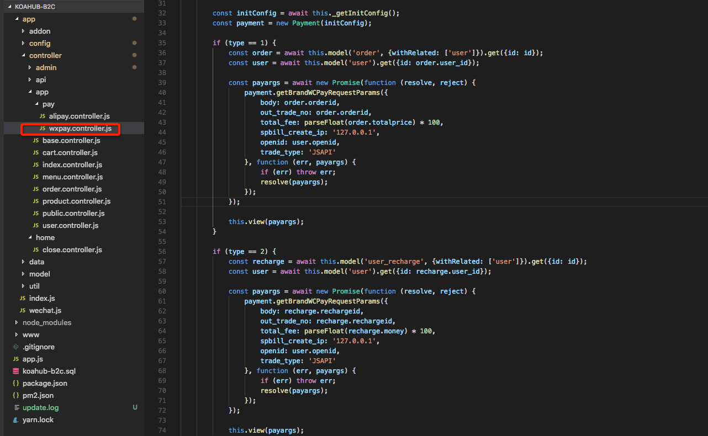
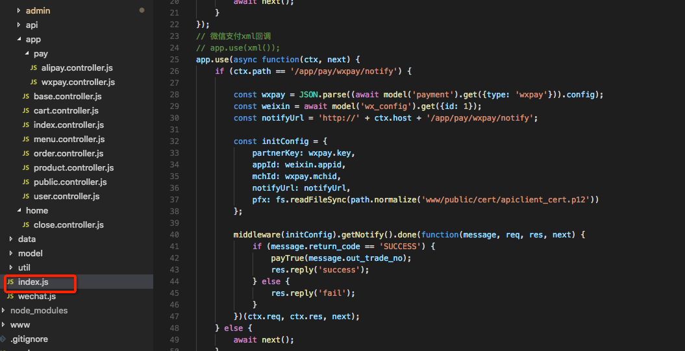

## 路由代码说明
> 本系统采用的是koahub.js的开发框架，koahub默认使用了自动加载路由，类似于thinkphp的开发方式。例如访问的路径是 /home/user/index，home会解析成模块，user会解析成控制器，index会解析成方法，此时会加载 app/controller/home/user.controller.js 下的index方法。  

在初始化时会进行路由的分发，路由解析到对应方法的代码如下

## 支付代码说明
### 微信端代码支付说明

###  微信端代码支付回调说明

### app的支付说明
[app相关配置](http://note.youdao.com/noteshare?id=b0c6fd4ede8494d43dc0f31e461d72ee)