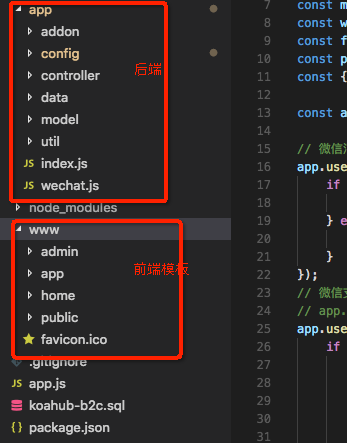

## 目录图片

### app目录为服务端代码
> #### addon 目录为插件目录便于扩展     
> #### config 为配置目录    
> bin.config.js 为 数据库的mysqldump和mysqlimport的路径配置，用于备份数据库  
> db.config.js 为数据库连接配置  
> default.config.js 为默认配置 port(端口号) default_module(默认加载模块) pageNum(分页时，每页数据) static(静态资源加载目录) loader(自动加载) csrf(跨域)  
> middleware.config.js 用于koahub js内核动态加载文件无缓存的初始化  
> router.config.js 用于配置路由，解决自己定义的方法名与框架的方法名冲突的问题  
> secret.config.js 用于配置jwt的秘钥  
> weixin.config.js 微信模板消息的配置
> #### controller 控制器目录
> admin 目录对应的是管理端的控制器
> api   目录对应的是app端的控制器
> app   目录对应的是微信端的控制器
> home  目录对应的站点关闭时的所执行的方法
> ####  data目录下 bookshelf.init.js  是使用knex与bookshelf链接数据库
> ####  model 模型
> ####  util 公共方法目录
> ####  index.js 初始化入口文件
> ####  wechat.js 封装的微信自定义回复和微信客服等微信相关的方法

### www目录为静态资源目录
> admin 管理端静态资源 (使用的是[handerbars](http://handlebarsjs.com/)+pjax的layout布局)   
> app   微信端 静态资源 (技术同管理端)  
> home  站点关闭展示页  
> public 公共文件(图片，证书，备份的数据库文件)  

